<p align="center">
  
</p>

<p align="center">
  <a href="https://opensource.org/licenses/GPL-3.0"></a>
  <a href="https://www.typescriptlang.org/"></a>
  <a href="https://www.electronjs.org/"></a>
  <a href="https://reactjs.org/"></a>
  <a href="https://mavlink.io/"></a>
  <a href="https://github.com/iNavFlight/inav/wiki/MSP-V2"></a>
</p>

<p align="center">
  <strong>A modern, cross-platform ground control station for ArduPilot, Betaflight, and iNav.</strong>
</p>

ArduDeck is a next-generation ground control station built with Electron, React, and TypeScript. It provides real-time telemetry, parameter management, PID tuning, and mission planning for drones and vehicles running ArduPilot, Betaflight, or iNav firmware.

> **One app for all your flight controllers** - Cross-platform (Windows, macOS, Linux), modern UI, supports both MAVLink and MSP protocols.

---

## Table of Contents

- [Features](#features)
- [Screenshots](#screenshots)
- [Quick Start](#quick-start)
- [Supported Vehicles](#supported-vehicles)
- [Veteran Board Support](#️-veteran-board-support)
- [Roadmap](#roadmap)
- [Contributing](#contributing)
- [Acknowledgments](#acknowledgments)

---

## Features

### Real-Time Telemetry
- **Attitude Indicator** - Roll, pitch, yaw with compass heading
- **Flight Data** - Altitude (MSL/AGL), airspeed, ground speed, climb rate
- **GPS Status** - Fix type, satellite count, HDOP, coordinates
- **Battery Monitor** - Voltage, current, remaining capacity with visual indicator
- **Flight Mode** - Armed/disarmed status, current mode display

### Interactive Map
- **Live Vehicle Tracking** - Real-time position with heading indicator
- **Flight Trail** - Historical path visualization
- **Multiple Layers** - Street, Satellite, Terrain, Dark mode
- **Home Position** - Distance and bearing to home
- **Overlays** - Compass, attitude indicator, stats

### Dockable Dashboard
- **IDE-Style Panels** - Drag & drop layout customization
- **Save/Load Layouts** - Multiple named layout profiles
- **Resizable Panels** - Flexible workspace arrangement

### Mission Planning
- **Interactive Map Editing** - Click to add waypoints, drag to reposition
- **Waypoint Table** - Beginner-friendly with human-readable summaries
- **Altitude Profile** - Terrain-aware visualization with drag-to-edit
- **Terrain Data** - Real elevation data from Open-Meteo (Copernicus DEM)
- **Collision Detection** - Visual warnings when path intersects terrain
- **Spline Waypoints** - Smooth curved flight paths with Catmull-Rom interpolation
- **Command Support** - Takeoff, Waypoint, Loiter, Land, RTL, Speed changes
- **File Operations** - Save/Load .waypoints and QGC .plan formats
- **Upload/Download** - Full MAVLink mission protocol support

### Parameter Management
- **Full Parameter List** - View all 800+ ArduPilot parameters
- **Search & Filter** - Quick parameter lookup by name or group
- **Inline Editing** - Click to edit, Enter to save, Escape to cancel
- **Real-Time Validation** - Range, enum, and increment checks with error tooltips
- **Modified Tracking** - Visual indicator with revert option
- **Write to Flash** - Persist changes to EEPROM with confirmation dialog
- **Save/Load Files** - Export and import .param files
- **Auto-Load Metadata** - Descriptions from ArduPilot XML + 600 fallback descriptions
- **MAVLink v1/v2 Auto-Detection** - Compatible with legacy and modern flight controllers

### Settings & Vehicle Profiles
- **Vehicle Profiles** - Create and manage multiple vehicle configurations
- **All Vehicle Types** - Copter, Plane, VTOL, Rover, Boat, Submarine
- **Type-Specific Properties** - Frame size, wingspan, hull type, thruster count, etc.
- **Performance Estimates** - Flight time, range, cruise speed based on specs
- **Live Weather** - GPS-based weather conditions from Open-Meteo API
- **Maritime Data** - Wave height, swell info for boats/subs
- **Persistent Storage** - Profiles saved to disk, survive app restarts

### Betaflight/iNav Configuration
- **Auto-Detection** - Automatically detects MSP protocol (Betaflight/iNav) vs MAVLink
- **PID Tuning** - Beginner-friendly presets (Beginner, Freestyle, Racing, Cinematic)
- **Rate Curves** - Visual rate curve editor with presets
- **Modes Wizard** - Step-by-step mode configuration with live RC feedback
- **Servo Wizard** - Fixed-wing servo setup with aircraft presets (Traditional, Flying Wing, V-Tail, Delta)
- **Platform Type Change** - Convert multirotor to airplane with MSP2 + CLI fallback for iNav 2.0.0
- **Custom Profiles** - Save/load custom PID tunes and rate profiles

### CLI Terminal
- **Full Terminal Emulation** - xterm.js with ANSI color support
- **Command Autocomplete** - Tab completion for commands and parameters
- **Parameter Suggestions** - Parsed from `dump` output for quick access
- **Command History** - Up/down arrow navigation through previous commands
- **Legacy Board Support** - Full configuration for F3-era boards via CLI

### OSD Simulator
- **Live Preview** - See exactly what appears in FPV goggles
- **Demo Mode** - Adjust telemetry values with sliders for font development
- **Live Mode** - Real-time display from connected flight controller
- **MCM Font Support** - Full MAX7456/AT7456E font parsing
- **8 Bundled Fonts** - Default, Bold, Clarity, Impact, Vision, and more
- **PAL/NTSC** - Support for both video standards (30x16 / 30x13 grids)
- **15+ OSD Elements** - Altitude, speed, battery, GPS, artificial horizon, CCRP indicator, and more
- **CCRP Indicator** - Continuously Computed Release Point for payload drops (shows predicted impact point)
- **Element Toggle** - Enable/disable individual OSD elements

### Firmware Flash
- **Multi-Protocol Detection** - Auto-detect boards via MAVLink, MSP, or STM32 bootloader
- **USB VID/PID Recognition** - 30+ known boards identified by USB IDs
- **ArduPilot Support** - Flash ArduCopter, ArduPlane, ArduRover, ArduSub
- **Betaflight/iNav Support** - Flash Betaflight and iNav firmware with curated version lists
- **F3 Legacy Support** - SPRacing F3 (iNav 2.0.0), FrSky F3 (iNav 2.6.1), Betaflight 3.5.7
- **Boot Pad Wizard** - Guided entry for boards requiring manual bootloader activation
- **STM32 Serial Bootloader** - Native USART flashing (no external tools needed)
- **Progress Tracking** - Real-time erase/write/verify progress with detailed logging
- **Firmware Caching** - Downloaded firmware cached for fast re-flashing

### Connectivity
- **Serial (USB)** - Direct connection via COM/ttyUSB ports
- **TCP Client** - Network connection to SITL or telemetry bridges
- **UDP** - Listen mode for MAVProxy and other forwarders
- **Auto-Detect** - Scan ports for MAVLink devices

### SITL Simulator & FlightGear Bridge

**What is this?** SITL (Software In The Loop) lets you run real flight controller firmware on your computer - no drone required! Perfect for:
- **Learning** - Practice mission planning and configuration without risking a crash
- **Testing** - Verify your settings work before uploading to real hardware
- **Development** - Test new features without leaving your desk

**How it works:**
1. ArduDeck downloads and runs the actual iNav/Betaflight firmware as a desktop application
2. The simulated flight controller behaves exactly like real hardware
3. You can configure PIDs, modes, missions - everything works!
4. Optionally connect to **FlightGear** (free flight simulator) to see your virtual aircraft fly

**FlightGear Integration** - If you have [FlightGear](https://www.flightgear.org/) installed, ArduDeck automatically detects it and can bridge the simulator to your SITL session. Watch your configured aircraft respond to your mission in a realistic 3D environment!

> **TL;DR**: Test your drone configuration on your computer before flying for real. Break things in simulation, not in the field!

---

## Screenshots

<p align="center">
  <a href="docs/screenshots/mission_planning.png?raw=true">
    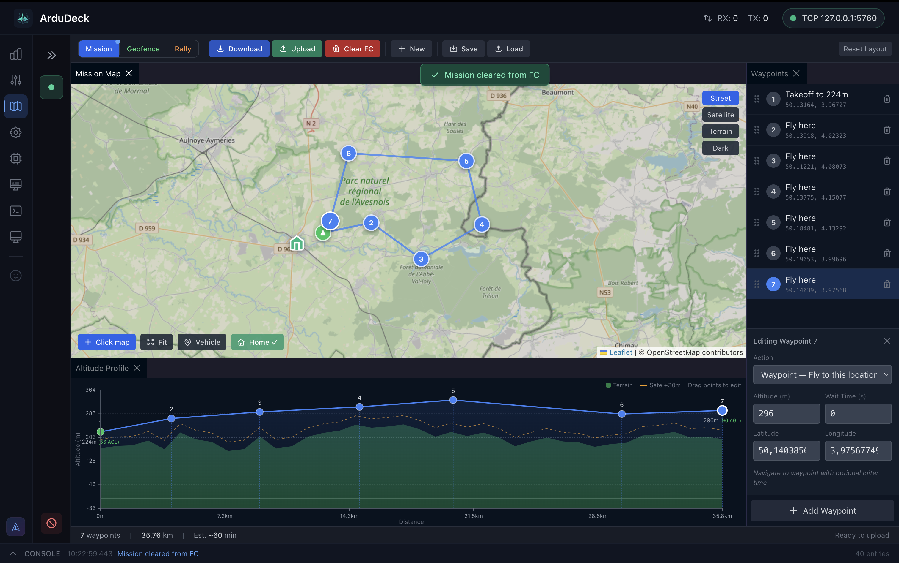
  </a>
  <br/>
  <em>Mission planning with terrain-aware altitude profile and automatic elevation data</em>
</p>

<table>
  <tr>
    <td align="center">
      <a href="docs/screenshots/mission_telemetry_layout.png?raw=true">
        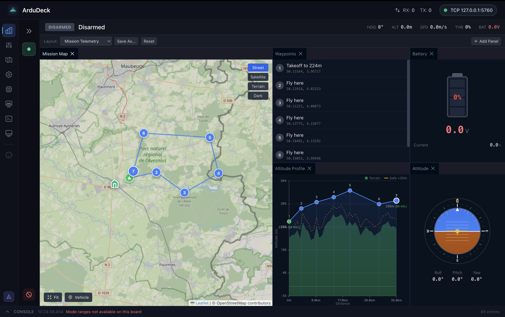
      </a>
      <br/><em>Mission + Telemetry Layout</em>
    </td>
    <td align="center">
      <a href="docs/screenshots/telemetry_dashboard.png?raw=true">
        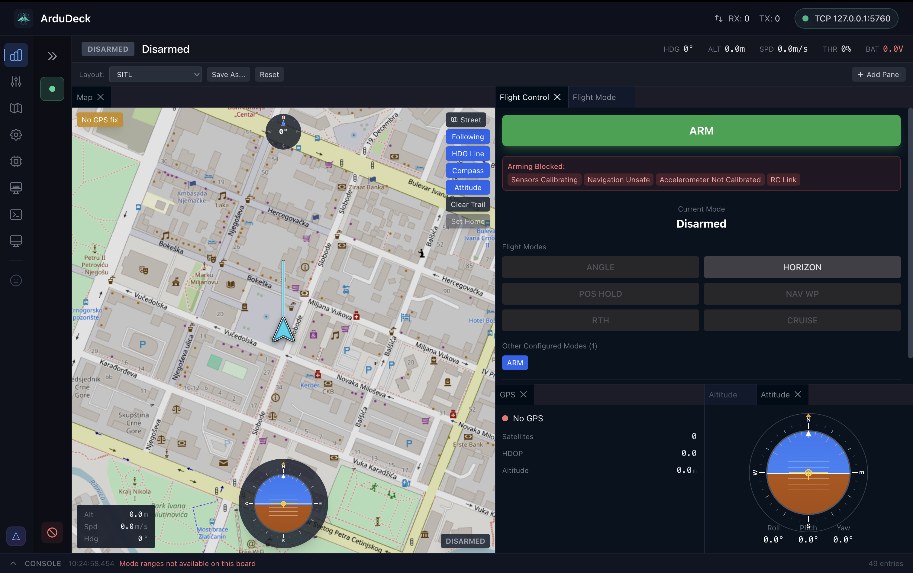
      </a>
      <br/><em>Telemetry Dashboard</em>
    </td>
  </tr>
  <tr>
    <td align="center">
      <a href="docs/screenshots/firmware_flash.png?raw=true">
        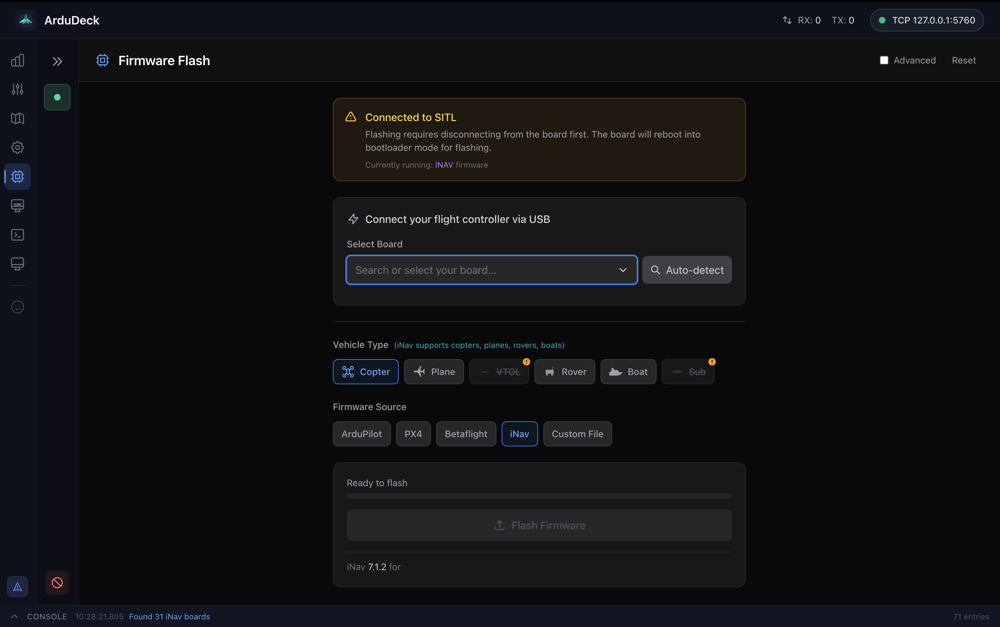
      </a>
      <br/><em>Firmware Flash</em>
    </td>
    <td align="center">
      <a href="docs/screenshots/settings_vehicle_profiles.png?raw=true">
        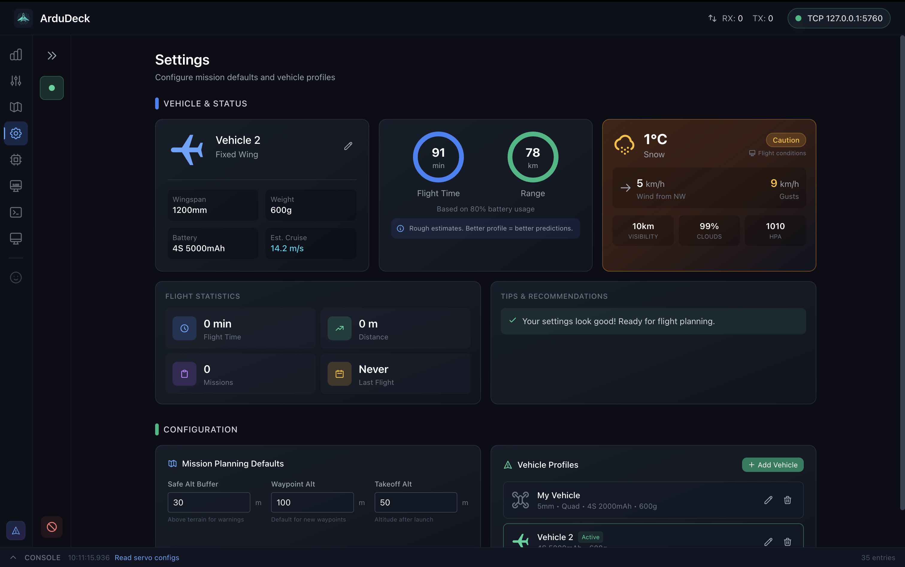
      </a>
      <br/><em>Vehicle Profiles & Weather</em>
    </td>
  </tr>
</table>

### Betaflight/iNav Configuration

<table>
  <tr>
    <td align="center">
      <a href="docs/screenshots/msp_pid_tuning.png?raw=true">
        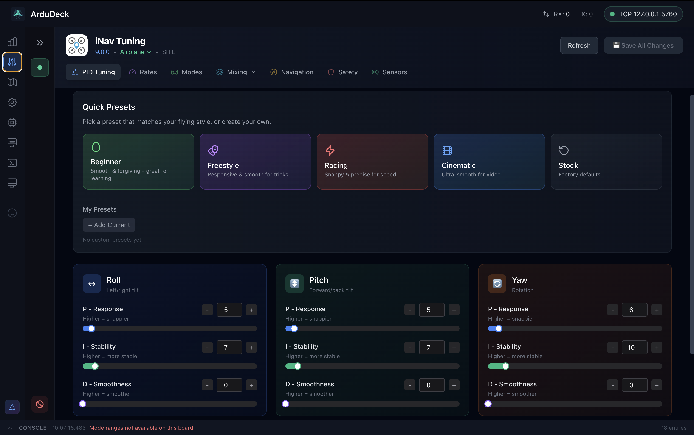
      </a>
      <br/><em>PID Tuning with Quick Presets</em>
    </td>
    <td align="center">
      <a href="docs/screenshots/msp_rates.png?raw=true">
        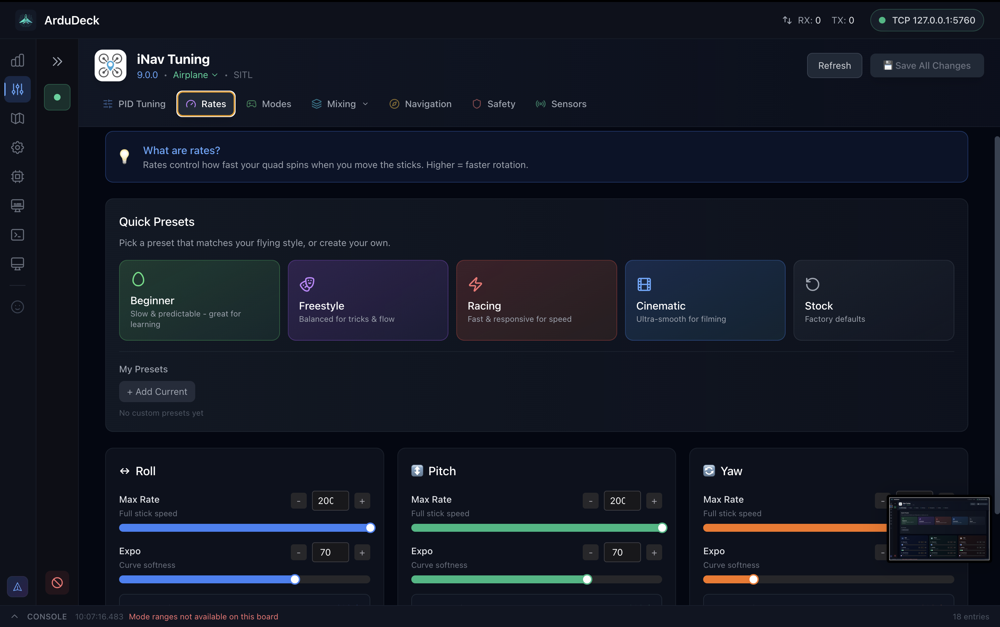
      </a>
      <br/><em>Rates & Expo Configuration</em>
    </td>
  </tr>
  <tr>
    <td align="center">
      <a href="docs/screenshots/msp_modes_simple.png?raw=true">
        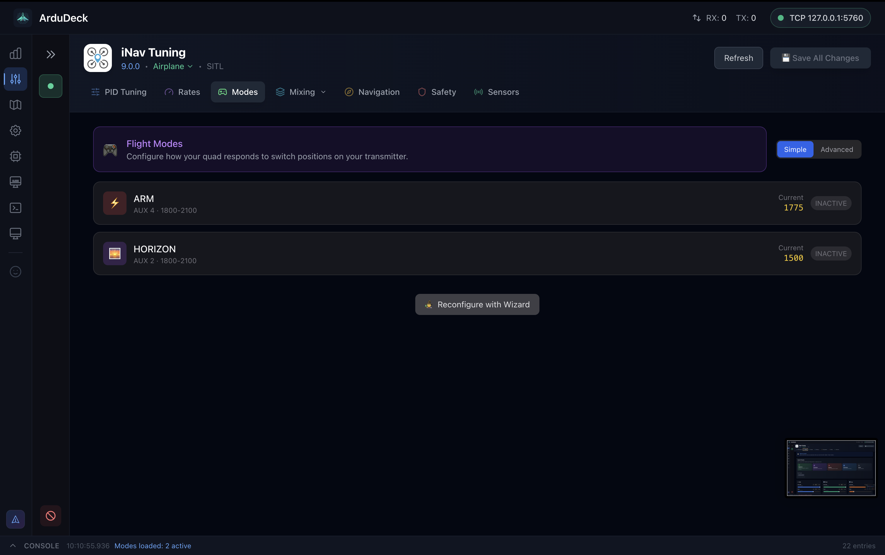
      </a>
      <br/><em>Flight Modes - Simple View</em>
    </td>
    <td align="center">
      <a href="docs/screenshots/msp_modes_wizard.png?raw=true">
        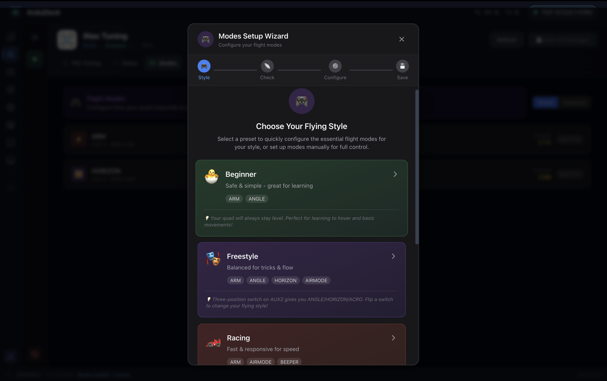
      </a>
      <br/><em>Modes Setup Wizard</em>
    </td>
  </tr>
  <tr>
    <td align="center">
      <a href="docs/screenshots/msp_modes_advanced.png?raw=true">
        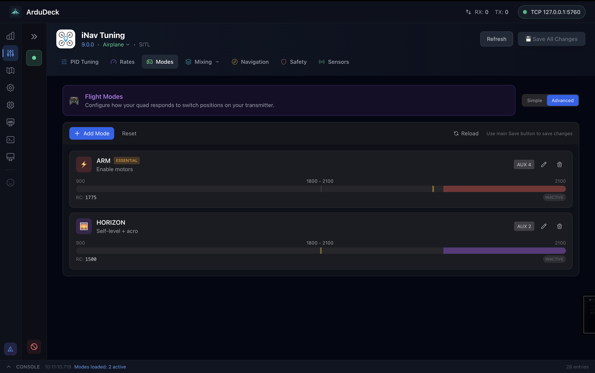
      </a>
      <br/><em>Flight Modes - Advanced View</em>
    </td>
    <td align="center">
      <a href="docs/screenshots/msp_servo_tuning.png?raw=true">
        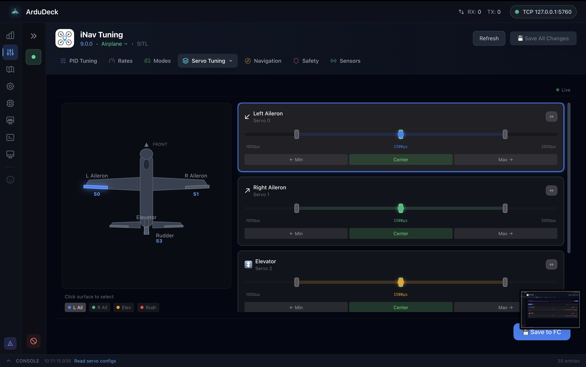
      </a>
      <br/><em>Servo Tuning for Fixed Wing</em>
    </td>
  </tr>
  <tr>
    <td align="center">
      <a href="docs/screenshots/msp_safety_failsafe.png?raw=true">
        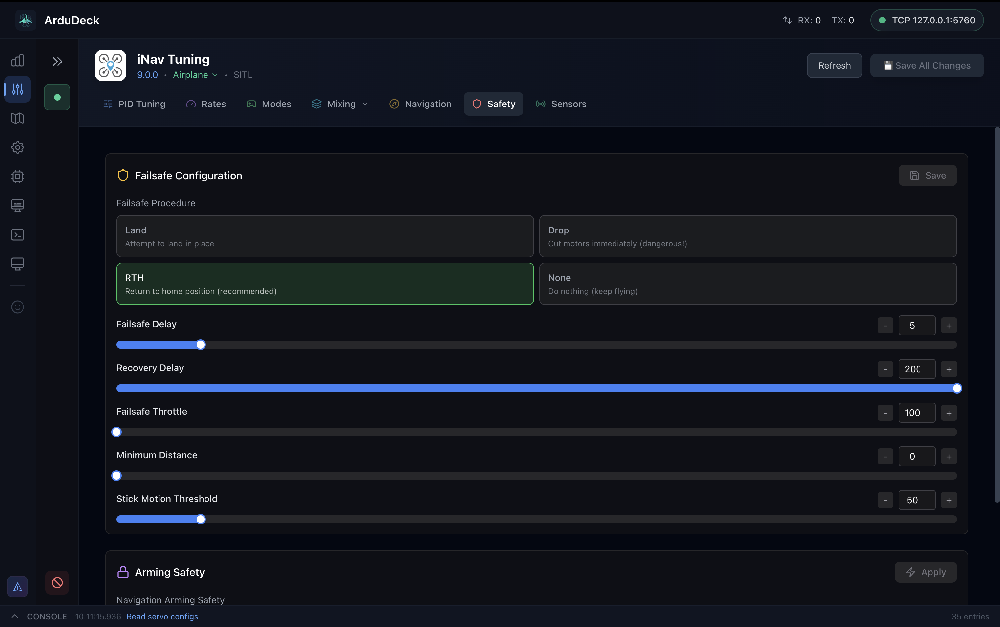
      </a>
      <br/><em>Safety & Failsafe Configuration</em>
    </td>
    <td align="center">
      <a href="docs/screenshots/msp_sensors.png?raw=true">
        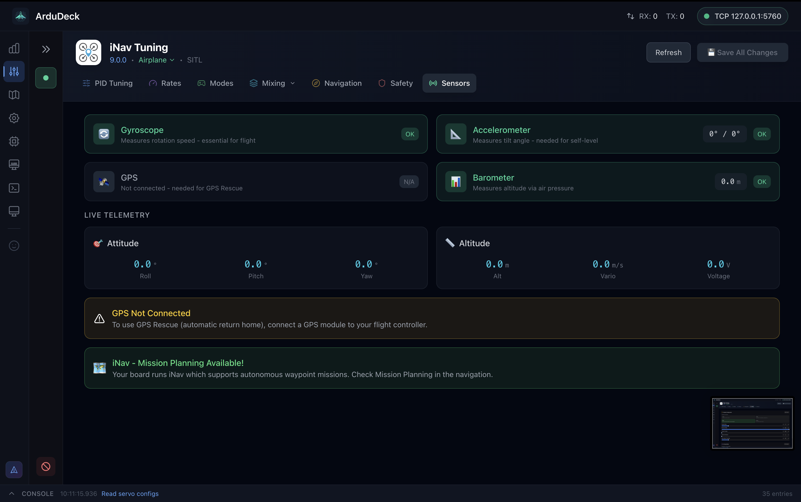
      </a>
      <br/><em>Sensors & Live Telemetry</em>
    </td>
  </tr>
</table>

### Additional Features

<table>
  <tr>
    <td align="center">
      <a href="docs/screenshots/osd_simulator_demo.png?raw=true">
        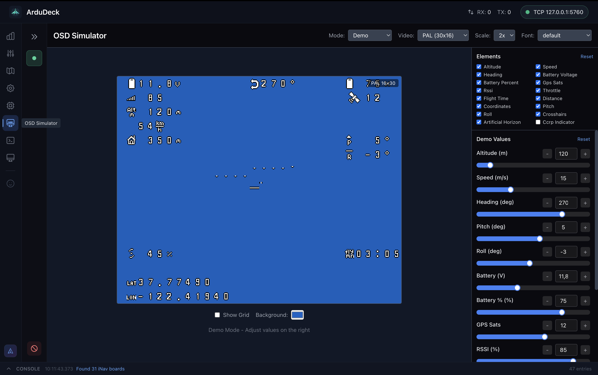
      </a>
      <br/><em>OSD Simulator - Demo Mode</em>
    </td>
    <td align="center">
      <a href="docs/screenshots/cli_terminal.png?raw=true">
        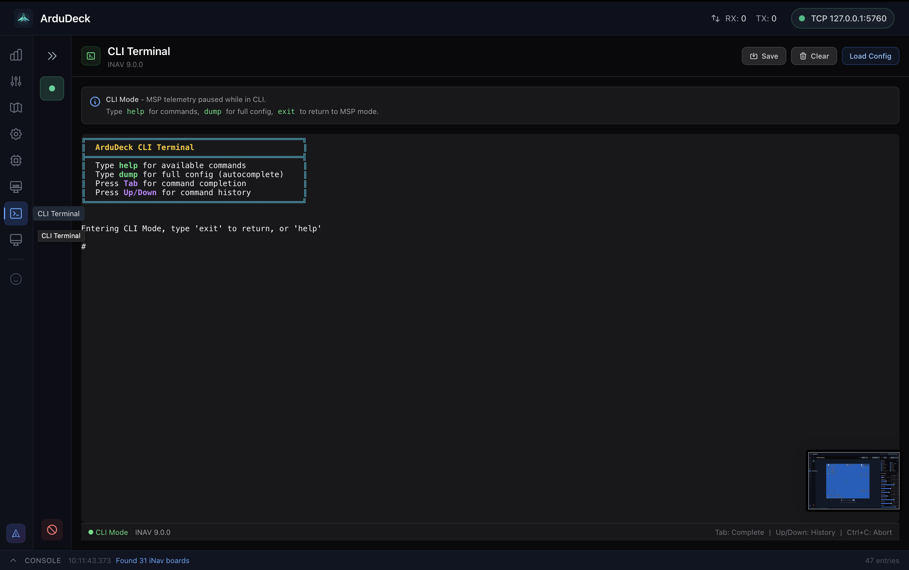
      </a>
      <br/><em>CLI Terminal with Autocomplete</em>
    </td>
  </tr>
  <tr>
    <td align="center">
      <a href="docs/screenshots/sitl_simulator.png?raw=true">
        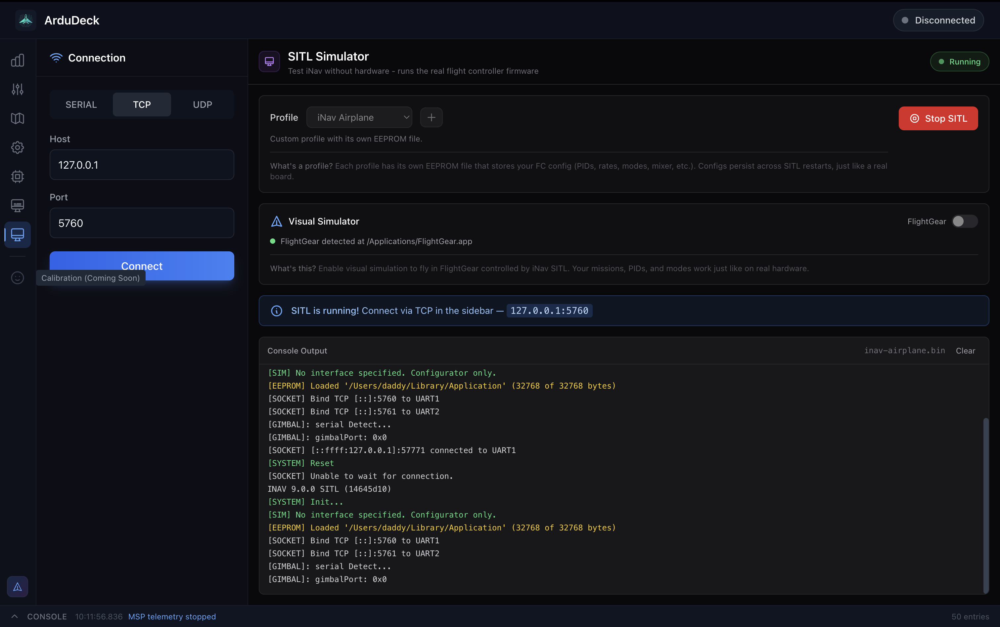
      </a>
      <br/><em>SITL Simulator with FlightGear</em>
    </td>
    <td align="center">
      <a href="docs/screenshots/params_screen.png?raw=true">
        
      </a>
      <br/><em>Parameter Management</em>
    </td>
  </tr>
</table>

---

## Quick Start

### Prerequisites

- **Node.js** 18 or higher
- **pnpm** 8 or higher

### Installation

```bash
# Clone the repository
git clone https://github.com/rubenCodeforges/ardudeck.git
cd ardudeck

# Install dependencies
pnpm install

# Build all packages
pnpm build

# Run in development mode
pnpm dev
```

### Build for Production

```bash
# Build all packages
pnpm build

# Package for distribution (coming soon)
# pnpm package
```

---

## Supported Vehicles

### ArduPilot (MAVLink)
- **Copter** - Quadcopters, hexacopters, octocopters
- **Plane** - Fixed-wing aircraft, flying wings
- **VTOL** - Tiltrotors, tailsitters, QuadPlanes
- **Rover** - Ground vehicles, boats
- **Submarine** - Underwater ROVs (ArduSub)

### Betaflight & iNav (MSP)
- **Multirotors** - Quads, hexes, octos, tris
- **Fixed Wing** - Traditional, flying wing, V-tail, delta
- **F3/F4/F7/H7** - All STM32 flight controllers

---

## 🎖️ Veteran Board Support

<p align="center">
  <em>"No board left behind"</em>
</p>

Got an old **SPRacing F3**, **Naze32**, or other F3-era board collecting dust? **We've got you covered.**

While other configurators have abandoned these classic boards, ArduDeck provides a **fully-featured graphical interface** - not just CLI access, but the **same modern UI experience** as newer boards:

| Board Era | Firmware Support | Configuration |
|-----------|------------------|---------------|
| **F3 Boards** | iNav 2.0.0, Betaflight 3.5.7 | **Full GUI** (powered by CLI) |
| **F4/F7/H7** | Latest iNav & Betaflight | Modern MSP Protocol |

### Why We Care

These boards were the **workhorses of the FPV revolution**. They flew millions of packs, survived countless crashes, and taught a generation of pilots how to tune PIDs. They deserve better than a drawer.

### Full GUI for Legacy Boards

No command-line typing required! ArduDeck automatically detects legacy boards and presents a **complete graphical interface**:

- **PID Tuning Tab** - Sliders and inputs for P/I/D/FF, just like modern boards
- **Rates Tab** - Visual rate configuration with expo curves
- **Mixer Tab** - Graphical motor (`mmix`) and servo (`smix`) mixer editor
- **Servo Tab** - Visual endpoint tuning with range indicators
- **Modes Tab** - Point-and-click flight mode assignment
- **CLI Terminal** - For power users who want raw access with autocomplete

The GUI talks to your board via CLI commands under the hood - you get the **convenience of a modern interface** with the **compatibility of CLI**.

### Supported Legacy Boards

- SPRacing F3 / F3 EVO / F3 Mini / F3 Neo
- Naze32 Rev6
- CC3D (with iNav)
- Flip32 F3
- Seriously Pro Racing F3
- ...and any other F3-era board running iNav < 2.1 or Betaflight < 4.0

**Dust off those veterans and give them one more flight!** 🛩️

---

## Roadmap

### Completed
- Real-time telemetry with dockable dashboard
- Interactive map with vehicle tracking
- Mission planning with terrain-aware altitude profile
- Full parameter management with validation
- Geofence and rally point editing
- Vehicle profiles with weather integration
- Firmware flashing (ArduPilot, Betaflight, iNav)
- Betaflight/iNav PID tuning and configuration
- **CLI Terminal** with autocomplete and command history
- **Legacy F3 board support** via full CLI configuration
- **OSD Simulator** with demo and live telemetry modes

### Coming Soon
- OSD element editor and font designer
- Calibration wizards (compass, accelerometer, radio)
- Auto-updater and crash reporting

---

## Contributing

Contributions are welcome! Please read our contributing guidelines before submitting PRs.

1. Fork the repository
2. Create a feature branch (`git checkout -b feature/amazing-feature`)
3. Commit your changes (`git commit -m 'Add amazing feature'`)
4. Push to the branch (`git push origin feature/amazing-feature`)
5. Open a Pull Request

---

## License

This project is licensed under the **GPL-3.0** - see the [LICENSE](LICENSE) file for details.

---

## Acknowledgments

- [ArduPilot](https://ardupilot.org/) - Open-source autopilot firmware
- [Betaflight](https://betaflight.com/) - Flight controller firmware for multirotors
- [iNav](https://github.com/iNavFlight/inav) - Navigation-focused flight controller firmware
- [Mission Planner](https://github.com/ArduPilot/MissionPlanner) - Original GCS that inspired this project
- [QGroundControl](http://qgroundcontrol.com/) - Cross-platform GCS inspiration
- [MAVLink](https://mavlink.io/) - Micro Air Vehicle communication protocol
- [Leaflet](https://leafletjs.com/) - Interactive maps library

---

<p align="center">
  Made with ❤️ by <a href="https://github.com/rubenCodeforges">Codeforges</a>
</p>
