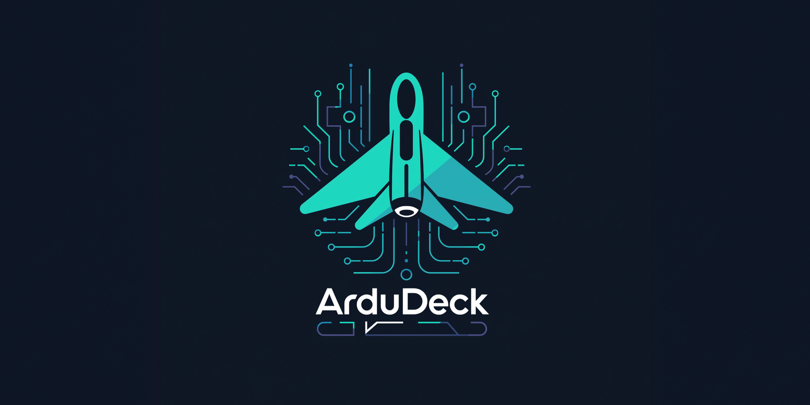
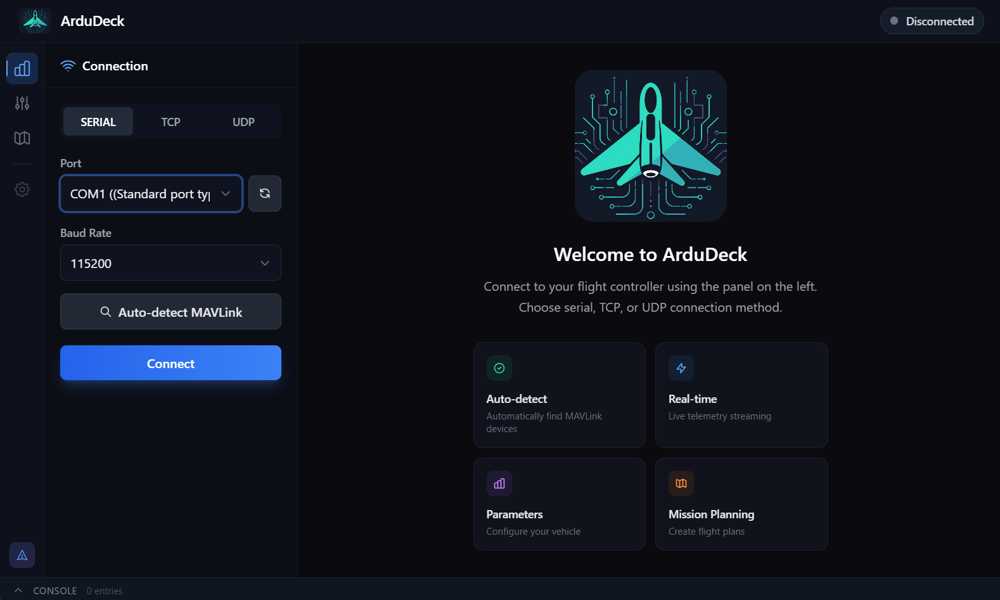
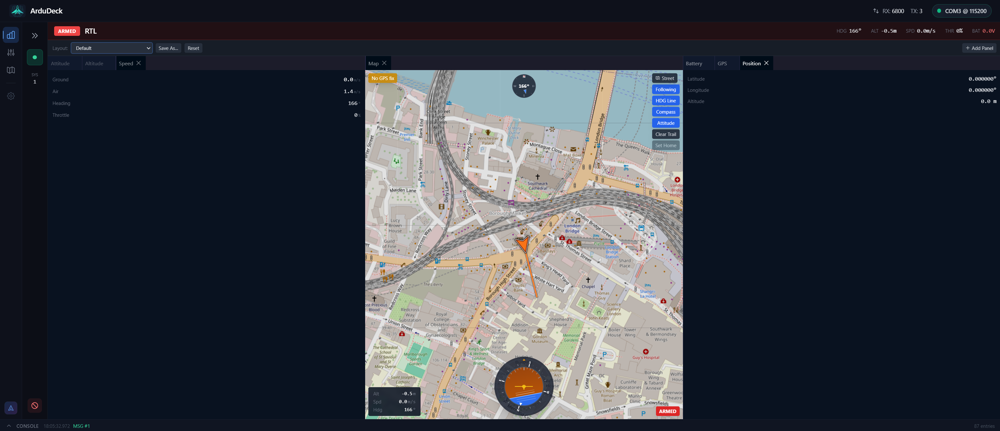
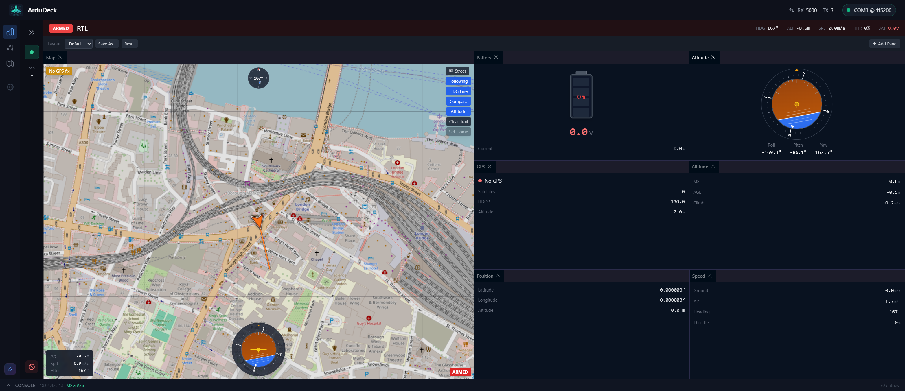
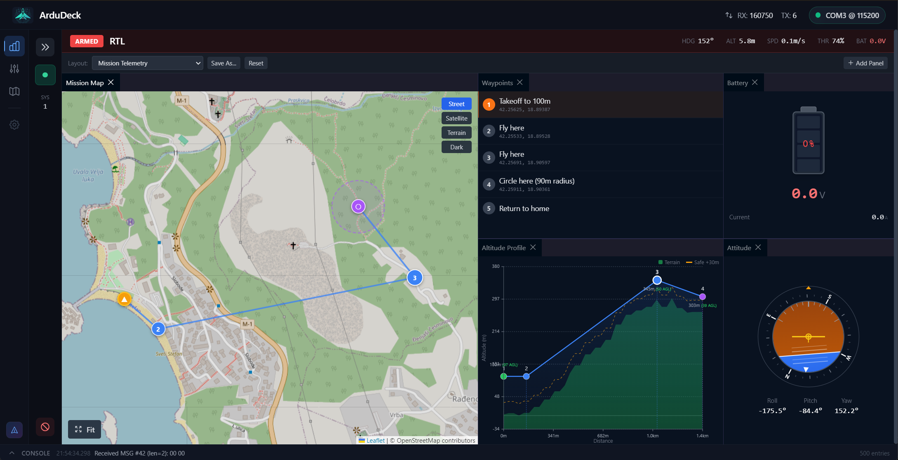
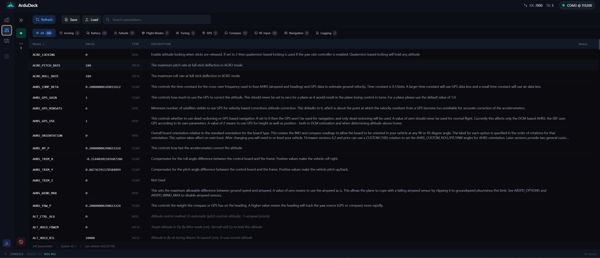
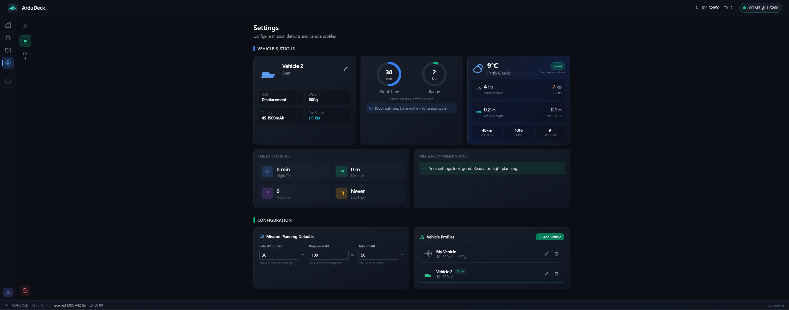

<p align="center">
  
</p>

<p align="center">
  <a href="https://opensource.org/licenses/GPL-3.0"></a>
  <a href="https://www.typescriptlang.org/"></a>
  <a href="https://www.electronjs.org/"></a>
  <a href="https://reactjs.org/"></a>
  <a href="https://mavlink.io/"></a>
</p>

<p align="center">
  <strong>A modern, cross-platform ground control station (GCS) for ArduPilot drones and vehicles.</strong>
</p>

ArduDeck is a next-generation mission planner built with Electron, React, and TypeScript. It provides real-time telemetry, parameter management, and mission planning for ArduPilot-powered UAVs, multirotors, planes, rovers, and boats.

> **Open-source alternative to Mission Planner** — Cross-platform (Windows, macOS, Linux), modern UI, fully typed MAVLink protocol implementation.

---

## Features

### Real-Time Telemetry
- **Attitude Indicator** — Roll, pitch, yaw with compass heading
- **Flight Data** — Altitude (MSL/AGL), airspeed, ground speed, climb rate
- **GPS Status** — Fix type, satellite count, HDOP, coordinates
- **Battery Monitor** — Voltage, current, remaining capacity with visual indicator
- **Flight Mode** — Armed/disarmed status, current mode display

### Interactive Map
- **Live Vehicle Tracking** — Real-time position with heading indicator
- **Flight Trail** — Historical path visualization
- **Multiple Layers** — Street, Satellite, Terrain, Dark mode
- **Home Position** — Distance and bearing to home
- **Overlays** — Compass, attitude indicator, stats

### Dockable Dashboard
- **IDE-Style Panels** — Drag & drop layout customization
- **Save/Load Layouts** — Multiple named layout profiles
- **Resizable Panels** — Flexible workspace arrangement

### Mission Planning
- **Interactive Map Editing** — Click to add waypoints, drag to reposition
- **Waypoint Table** — Beginner-friendly with human-readable summaries
- **Altitude Profile** — Terrain-aware visualization with drag-to-edit
- **Terrain Data** — Real elevation data from Open-Meteo (Copernicus DEM)
- **Collision Detection** — Visual warnings when path intersects terrain
- **Spline Waypoints** — Smooth curved flight paths with Catmull-Rom interpolation
- **Command Support** — Takeoff, Waypoint, Loiter, Land, RTL, Speed changes
- **File Operations** — Save/Load .waypoints and QGC .plan formats
- **Upload/Download** — Full MAVLink mission protocol support

### Parameter Management
- **Full Parameter List** — View all 800+ ArduPilot parameters
- **Search & Filter** — Quick parameter lookup by name or group
- **Inline Editing** — Click to edit, Enter to save, Escape to cancel
- **Real-Time Validation** — Range, enum, and increment checks with error tooltips
- **Modified Tracking** — Visual indicator with revert option
- **Write to Flash** — Persist changes to EEPROM with confirmation dialog
- **Save/Load Files** — Export and import .param files
- **Auto-Load Metadata** — Descriptions from ArduPilot XML + 600 fallback descriptions
- **MAVLink v1/v2 Auto-Detection** — Compatible with legacy and modern flight controllers

### Settings & Vehicle Profiles
- **Vehicle Profiles** — Create and manage multiple vehicle configurations
- **All Vehicle Types** — Copter, Plane, VTOL, Rover, Boat, Submarine
- **Type-Specific Properties** — Frame size, wingspan, hull type, thruster count, etc.
- **Performance Estimates** — Flight time, range, cruise speed based on specs
- **Live Weather** — GPS-based weather conditions from Open-Meteo API
- **Maritime Data** — Wave height, swell info for boats/subs
- **Persistent Storage** — Profiles saved to disk, survive app restarts

### Firmware Flash
- **Multi-Protocol Detection** — Auto-detect boards via MAVLink, MSP, or STM32 bootloader
- **USB VID/PID Recognition** — 30+ known boards identified by USB IDs
- **ArduPilot Support** — Flash ArduCopter, ArduPlane, ArduRover, ArduSub
- **Betaflight Support** — Flash Betaflight/iNav/Cleanflight firmware
- **Boot Pad Wizard** — Guided entry for boards requiring manual bootloader activation
- **STM32 Serial Bootloader** — Native USART flashing (no external tools needed)
- **Progress Tracking** — Real-time erase/write/verify progress with detailed logging
- **Firmware Caching** — Downloaded firmware cached for fast re-flashing

### Connectivity
- **Serial (USB)** — Direct connection via COM/ttyUSB ports
- **TCP Client** — Network connection to SITL or telemetry bridges
- **UDP** — Listen mode for MAVProxy and other forwarders
- **Auto-Detect** — Scan ports for MAVLink devices

---

## Screenshots

### Welcome Screen
*Clean connection interface with serial, TCP, and UDP options*



### Telemetry Dashboard
*Real-time flight data with customizable dockable panels*



### Custom Dashboard Layouts
*Drag & drop panels to create your perfect workspace*



### Mission Planning
*Interactive map with waypoint editing and terrain-aware altitude profile*


### Mission + Telemetry
*Monitor live telemetry alongside your mission plan*



### Parameter Management
*Search, edit, and validate 800+ ArduPilot parameters*



### Settings & Vehicle Profiles
*Manage multiple vehicles with type-specific properties and live weather*



---

## Quick Start

### Prerequisites

- **Node.js** 18 or higher
- **pnpm** 8 or higher

### Installation

```bash
# Clone the repository
git clone https://github.com/rubenCodeforges/ardudeck.git
cd ardudeck

# Install dependencies
pnpm install

# Build all packages
pnpm build

# Run in development mode
pnpm dev
```

### Build for Production

```bash
# Build all packages
pnpm build

# Package for distribution (coming soon)
# pnpm package
```

---

## Tech Stack

| Category | Technology |
|----------|------------|
| Framework | Electron 28 |
| Frontend | React 18 + TypeScript 5 |
| Build Tool | Vite + electron-vite |
| Styling | Tailwind CSS |
| State Management | Zustand |
| Maps | Leaflet + react-leaflet |
| Dashboard | dockview-react |
| Monorepo | Turborepo + pnpm |

---

## Project Structure

```
ardudeck/
├── apps/
│   └── desktop/              # Electron desktop application
│       ├── src/main/         # Main process (IPC, transports)
│       ├── src/renderer/     # React UI components
│       └── src/shared/       # Shared types and constants
├── packages/
│   ├── mavlink-ts/           # TypeScript MAVLink protocol library
│   │   ├── core/             # Parser, serializer, CRC, signing
│   │   └── generated/        # Auto-generated messages & enums
│   └── comms/                # Communication transports
│       └── src/              # Serial, TCP, UDP implementations
├── tools/
│   └── mavlink-generator/    # MAVLink XML → TypeScript codegen
└── docs/                     # Documentation
```

---

## Packages

### @ardudeck/mavlink-ts

Full TypeScript implementation of the MAVLink protocol:

- **207 enums** and **352 messages** from all ArduPilot dialects
- Async stream parser with `AsyncGenerator` API
- MAVLink v1 and v2 serialization
- Message signing support
- X25 CRC validation

### @ardudeck/comms

Transport abstraction layer:

- `SerialTransport` — USB/COM port communication
- `TcpTransport` — TCP client connections
- `UdpTransport` — UDP listen mode
- Port scanner with auto-detect

---

## Supported Vehicles

ArduDeck supports all ArduPilot vehicle types:

- **Copter** — Quadcopters, hexacopters, octocopters
- **Plane** — Fixed-wing aircraft, flying wings
- **VTOL** — Tiltrotors, tailsitters, QuadPlanes
- **Rover** — Ground vehicles, boats
- **Submarine** — Underwater ROVs (ArduSub)
- **Antenna Tracker** — Ground-based trackers

---

## Roadmap

- [x] **Epic 1** — Foundation (Monorepo, MAVLink library, Transports)
- [x] **Epic 2** — Connection & Telemetry (Real-time data, Dashboard)
- [x] **Epic 2.5** — Dockable Dashboard (Panel system, Layout persistence)
- [x] **Epic 2.6** — Map Panel (Leaflet, Vehicle tracking, Overlays)
- [x] **Epic 3** — Parameter Management (Download, Edit, Upload)
- [x] **Epic 3.5** — Parameter Metadata (Grouping, Auto-load, 600+ descriptions)
- [x] **Epic 3.6** — Parameter File Operations (Write to Flash, Save/Load files, Toasts)
- [x] **Epic 3.7** — Parameter Validation (Range, Enum, Increment checks)
- [x] **Epic 4** — Mission Planning (Waypoints, Map editing, Altitude profile, Terrain)
- [x] **Epic 4.5** — Settings & Vehicle Profiles (Multi-vehicle, Weather, Persistence)
- [x] **Epic 4.7** — Geofence & Rally Points (Inclusion/exclusion zones, Emergency landing)
- [x] **Epic 5** — Firmware Flash (Board detection, ArduPilot/Betaflight flashing)
- [ ] **Epic 6** — Calibration Wizards (Compass, Accelerometer, Radio)
- [ ] **Epic 7** — Production Ready (Auto-updater, Logging, Mobile app)

---

## Contributing

Contributions are welcome! Please read our contributing guidelines before submitting PRs.

1. Fork the repository
2. Create a feature branch (`git checkout -b feature/amazing-feature`)
3. Commit your changes (`git commit -m 'Add amazing feature'`)
4. Push to the branch (`git push origin feature/amazing-feature`)
5. Open a Pull Request

---

## License

This project is licensed under the **GNU General Public License v3.0** — see the [LICENSE](LICENSE) file for details.

ArduDeck is free software: you can redistribute it and/or modify it under the terms of the GNU General Public License as published by the Free Software Foundation, either version 3 of the License, or (at your option) any later version.

---

## Author

**Ruben M** — [Codeforges](https://github.com/rubenCodeforges)

Built with passion by Codeforges.

---

## Acknowledgments

- [ArduPilot](https://ardupilot.org/) — Open-source autopilot firmware
- [Mission Planner](https://github.com/ArduPilot/MissionPlanner) — Original GCS reference
- [MAVLink](https://mavlink.io/) — Micro Air Vehicle communication protocol
- [QGroundControl](http://qgroundcontrol.com/) — Cross-platform GCS inspiration
- [Leaflet](https://leafletjs.com/) — Interactive maps library

---

## Keywords

`ardupilot` `ground-control-station` `gcs` `drone` `uav` `mavlink` `mission-planner` `quadcopter` `multirotor` `flight-controller` `pixhawk` `electron` `react` `typescript` `telemetry` `fpv` `rc` `unmanned-aerial-vehicle`
